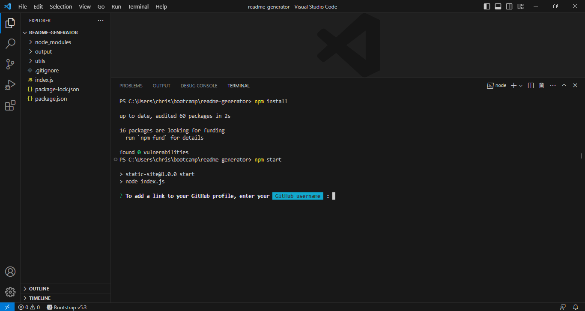
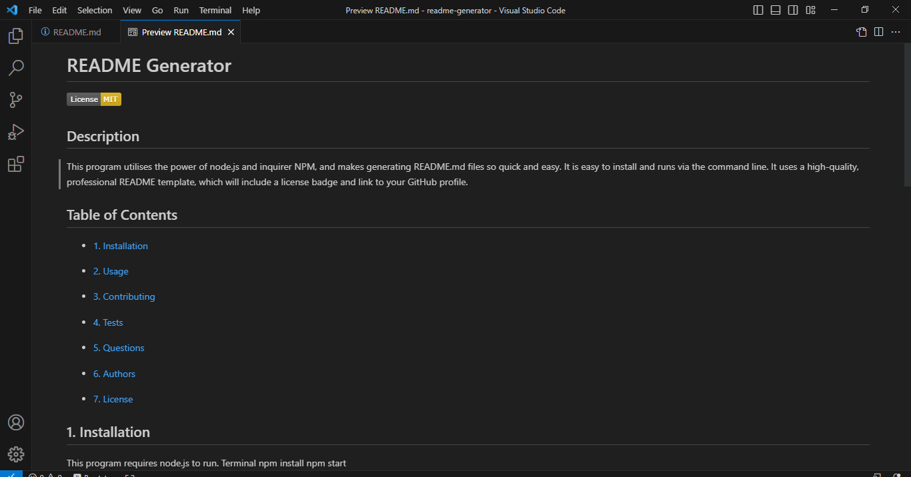

# README Generator

[](https://opensource.org/licenses/MIT)

## Description

This program utilises the power of node.js and Inquirer v8.2.4 NPM, and makes
generating README.md files so quick and easy. It is easy to install and runs via
the command line. It uses a high-quality, professional README template, which
will include a license badge and link to your GitHub profile.


Watch the [walkthrough video](https://drive.google.com/file/d/1deoVVa3tOemJKzGV2mfYfNqwUOaCgqcA/view?usp=sharing) to
view the program's functionality.

---

## Table of Contents

-   [1. Installation](#1-installation)

-   [2. Usage](#2-usage)

-   [3. Contributing](#3-contributing)

-   [4. Tests](#4-tests)

-   [5. Questions](#5-questions)

-   [6. Authors](#6-authors)

-   [7. License](#-license)

## 1. Installation

1. Download the source code or clone the source code, via the GitHub repository.

2. Using the provided link, download and install the LTS version of
   [Node.JS](https://nodejs.org/en/download/current)

3. Run the following command to verify that it has been installed:

```
node -v
```

4. Navigate to the source code folder either in the command line or throught the
   terminal in VS Code.
5. Run the following command to install the NPM depencies to run the program:

```
npm install
```

6. Once this is completed, the program is installed and can be run using the
   following command:

```
npm start
```

PLEASE NOTE: To use Node.JS and Inquirer NPM you need a suitable command line
tool, such as Windows Command Prompt (CMD), PowerShell, or GIT Bash.



## 2. Usage

The program will prompt you for input to a series of questions which it will then use to generate your README. 
The sections included in the template are:
* Title
* Description
* Installation
* Usage
* Contributing
* Tests
* Questions
* Author/s
* License and License badge
* GitHub profile link



## 3. Contributing

Not currently accepting contribution to this project.

## 4. Tests

N/A

## 5. Questions

For any questions or support with using this application,

Submit an issue through my [GitHub Profile](https://github.com/ChristineLea)

## 6. Authors

Christine Lea
Completed as part of the Monash University Full Stack Flex Bootcamp.

## 7. License

This project is covered under MIT license.
